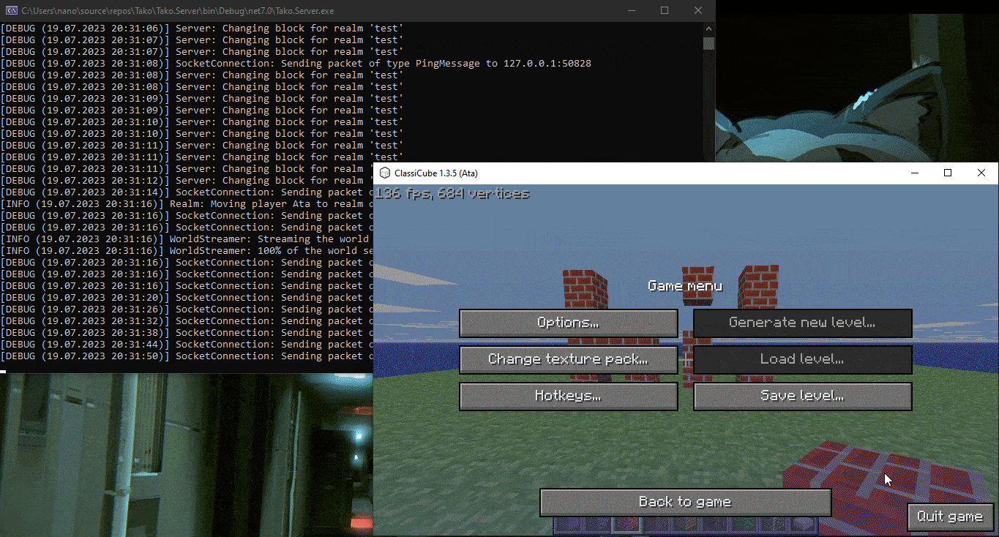

   
  <b>Tako (タコ) 🐙 - An extensible Minecraft Classic server.</b>

---

# Tako

Tako is an extensible multi-world Minecraft Classic / ClassiCube server written in C# on .NET 7. Its aim is to be cross-platform, performant and allow for easy plugin creation.

In order to build it, clone the repo and build the Tako.Server project. The server can then be launched by launching the `Tako.Server.exe` executable.

So far it supports all of the Classic 0.30 packets (with delta movement support yet to come).

# Plugins

While still in the planning stage, Tako was designed with an easy to write-for plugin system in mind. The plan is for Plugins to be written in C# and compiled on the go by Tako utilizing Roslyn.

All of the definitions needed for plugins will be exposed via the `Tako.Definitions` and `Tako.Common` projects, without exposing the actual internal server classes.

# TODOs

- [x] Parsing and sending packets
- [x] Synchronizing the world
- [x] Realms (multi-world server)
- [ ] Loading configuration
- [ ] Saving/loading realms and worlds
- [ ] A reimplementation of Classic's world gen.
- [ ] The plugin interface and plugin loading.
- [ ] Support for various [Classic Protocol Extensions](https://wiki.vg/Classic_Protocol_Extension) features.

## Contributing Guide

If you'd really want to contribute to this project (thank you!) please adhere to the [Conventional Commits](https://www.conventionalcommits.org/en/v1.0.0/) commit format as much as you can.
